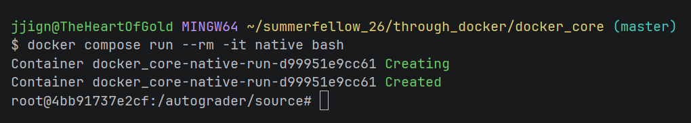
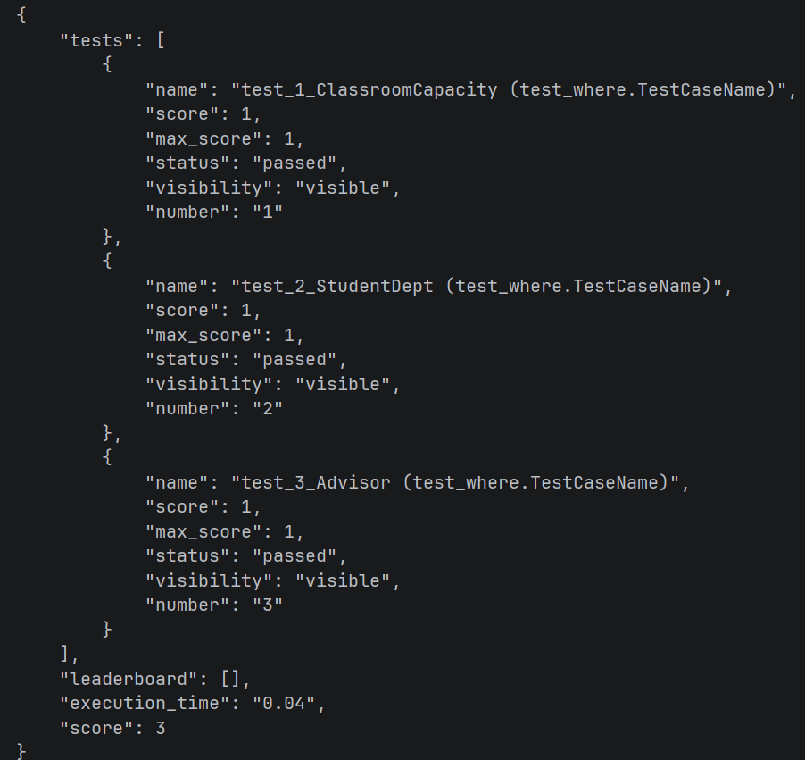
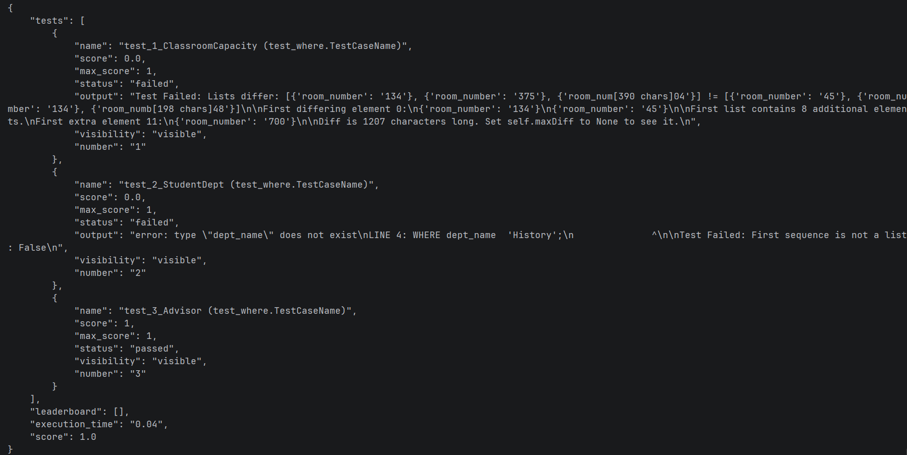
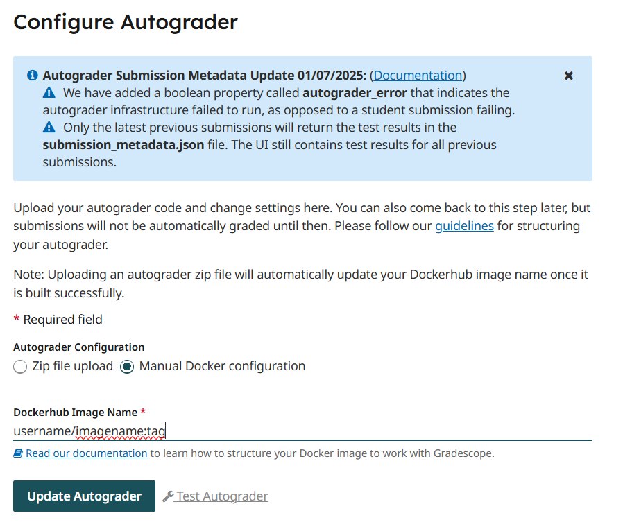

## Tutorial For Testing Queries 

#### The assignment
Let's say we have an assignment about the `where` conditional, and we are using the University database. Let's start by 
defining our questions:
* Find the room number of all classrooms with capacity of greater than 50.
* Find the name of all students in the History department.
* Find id of all students advised by 59795.

We'll call the assignment "Where Queries" and call the homework file `where.sql`

#### Gold File
Next lets make our gold file. First we need to make our queries:
    
    
    SELECT room_number
    FROM classroom
    WHERE capacity > 50;
    
    SELECT name 
    FROM student 
    WHERE dept_name = 'History';

    SELECT s_id 
    FROM advisor
    WHERE i_id = '59795';

Now we add them to a `.sql` file. Let's call it `goldWhere.sql` It looks like this:

    --@_@-- 
    SELECT room_number
    FROM classroom
    WHERE capacity > 50;
    --@_@--
    SELECT name 
    FROM student 
    WHERE dept_name = 'History';
    --@_@--
    SELECT s_id 
    FROM advisor
    WHERE i_id = '59795';

Notice the `--@_@--` before the queries. These are always needed in any gold file that is a `.sql`. 

#### 'test_*.py'
Now let's move to the `test_*.py`. We will call ours `test_where.py`. We will use the `query_HW_template.py` from `Read`.
We don't need to change any of the imports or class setup and thus will leave them as is. Let's configure our tests:

    @weight(1)              # question is worth 1 point
    @number("1")            # this is problem #1  
    @visibility("visible")  # student can always see this test 
    @timeout(5)             # question should run in less than 5 seconds
    def test_1_ClassroomCapacity(self): 
        true = self.gold.next_sql()     # run gold query and get rows
        out = self.query.next_sql()     # run student query and get rows
        self.assertListEqual(out, true) # check student rows with gold rows

    @weight(1) 
    @number("2") 
    @visibility("visible")
    @timeout(5)               
    def test_2_StudentDept(self):
        true = self.gold.next_sql()
        out = self.query.next_sql()
        self.assertListEqual(out, true)

    @weight(1) 
    @number("3") 
    @visibility("visible")
    @timeout(5)               
    def test_3_Advisor(self):
        true = self.gold.next_sql()
        out = self.query.next_sql()
        self.assertListEqual(out, true)

Remember that functions named `test_*` are treated as test cases. So we name each function based on which question it is testing. 
Remember as well, __tests run in alphabetical order.__ So we give each name a number to make sure they run in the correct order. __When testing more than 10 queries, remember to add a leading zero to all queries names.__
Each question is worth 1 point so `@weight` is set to 1. We increment `@number` to reflect the order of the tests. We'll leave
`@visibility` on visible as we want to students to see the results. Finally, we'll leave `@timeout` at 5 seconds. The rest of the
function will run our test cases as we want them, so we're done here.

#### File preparation and `Dockerfile` Configuration
Now we need to configure the `Dockerfile` with the correct data. `Read` already has an archive file and a user setup file,
so we'll use those. We'll move `goldWhere.sql`, `build`, and `dbUserSet.sql` into `source`. `test_where.py` we'll put into 
`tests`. Now we set the environment variables:

    ENV HW_NAME="where.sql"         # name of student submission 
    ENV GOLD_FILE="goldWhere.sql"   # name of gold file prof wrote

    ENV SOL_NUM="3"                 # expect number of solutions in HW_NAME

    # default is fine for now
    ENV DB_USER="testee"            # default user that will be used to connect to database
    ENV DB_NAME="testee"            # default database that will be connected to

    ENV DB_USER_SET="dbUserSet.sql" # set the users that will be used for testing

    ENV PRIV_SET=""                 # set privileges for users

    ENV DB_BUILD="build"            # archive file from pg_dump

We set `HW_NAME`, `GOLD_FILE`, `DB_USER_SET`, and `DB_BUILD` to their respective file names. `SOL_NUM` is set to 3 as our 
assignment has three problems, and we are expecting three answers. `BD_USER` and `DB_NAME` don't need to be changed. `PRIV_SET` 
is left blank as we are not testing privileges. 

#### Local Testing 
Now we should test our PTE before giving it to Gradescope. To do this will need a sample student file. This can anything from 
something you think a student might write to just a copy of the gold file. We will use a copy of the gold file and call it `where.sql`
just like a student submitted file. Put this file in `local_testing/submission`. Now in a terminal navigate into `docker_core`. 
First run `docker compose build native`. Then run `docker compose run --rm -it native bash`. You will see something like this:

From here run `../run_autograder ; cat ../results/results.json` You will get the test results as output. 

 

To exit the PTE, run `exit`.

Let's run one more test to make sure the PTE is working correctly. We'll edit `where.sql` to give some wrong answers.

    --@_@--
    SELECT room_number
    FROM classroom
    WHERE capacity < 50;
    --@_@--
    SELECT name
    FROM student
    WHERE dept_name  'History';
    --@_@--
    SELECT s_id
    FROM advisor
    WHERE i_id = '59795';

The operator in the frist query has been flipped around and the `=` from the second query has been removed. 
Let's run `docker compose run --rm -it native bash` and `../run_autograder ; cat ../results/results.json` again and see 
what we get:

The frist two test cases fail and the last one succeeds. The PTE is working fine. Time to give it to Gradescope.

#### Gradescope

Run `docker build -t username/imagename:tag .` to build the PTE image. Then run `docker push username/imagename:tag` to push
the image to Docker Hub. Now, when configuring the autograder in Gradescope select  "Manual Docker Configuration" and put the
name of your image.

Now you assignment is ready to accept student submissions.